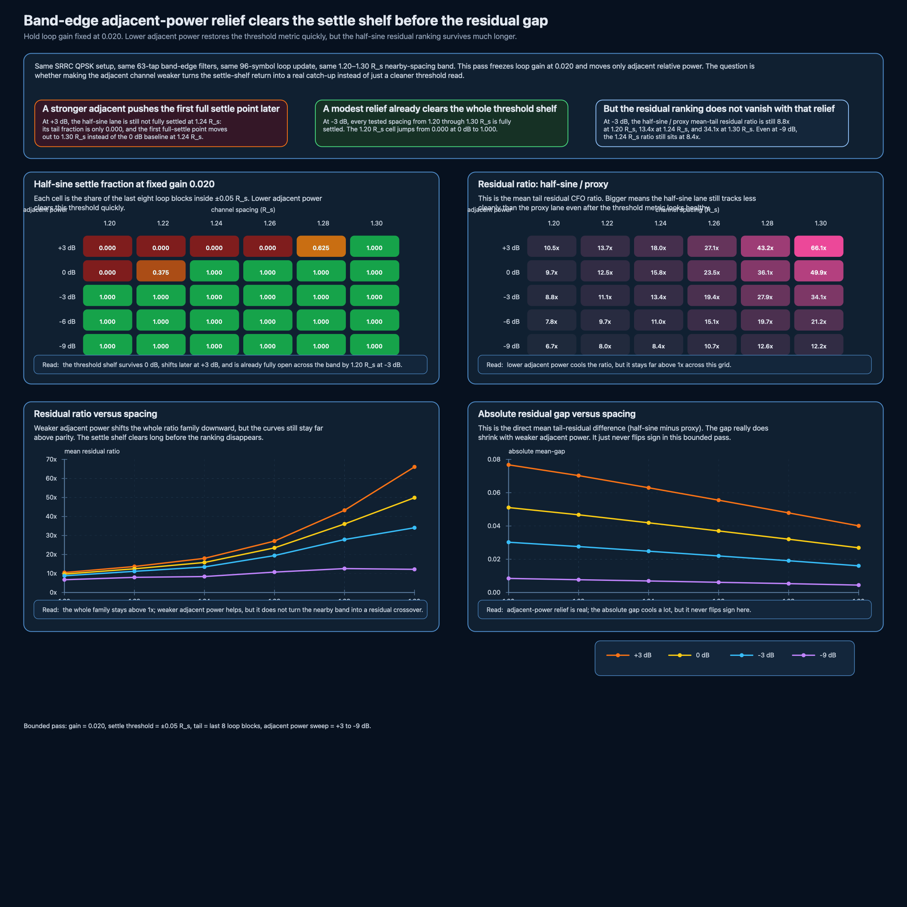

# Band-edge adjacent-power relief clears the settle shelf before the residual gap

The last band-edge note left one fair follow-up.

If the nearby channel gets weaker, does the half-sine lane actually start catching up again, or does the settle shelf just become easier to clear?

This note keeps the harder loop gain fixed and changes only the nearby interferer power.
The answer is sharper than a generic “weaker adjacent is better.”

Yes, weaker adjacent power reopens the threshold metric fast.
No, it does **not** erase the residual ranking nearly as fast.

## 1. What moves in this pass

Keep the same bounded setup as the settle-shelf note:

- SRRC QPSK
- `4 samples/symbol`
- `3072` symbols
- roll-off `α = 0.35`
- `63`-tap band-edge filters
- one blockwise frequency loop with `96` symbols per update
- tail summary over the last `8` loop blocks
- settle band fixed at `±0.05 R_s`
- loop gain fixed at `0.020`
- channel spacing from `1.20` to `1.30 R_s`

Only one knob moves now:

- adjacent relative power from `+3 dB` down to `-9 dB`

So this is still not BER, not AGC, not timing recovery, and not a full modem contest.
It is a bounded question about how much adjacent-power relief actually buys inside the nearby spacing shelf.

## 2. Three rows that say most of it

| adjacent power | spacing | half-sine settle fraction | half-sine / proxy mean-tail residual ratio | absolute mean-tail gap |
|---|---:|---:|---:|---:|
| `+3 dB` | `1.24 R_s` | `0.000` | `18.0×` | `0.0630 R_s` |
| `-3 dB` | `1.24 R_s` | `1.000` | `13.5×` | `0.0248 R_s` |
| `-9 dB` | `1.24 R_s` | `1.000` | `8.4×` | `0.0070 R_s` |

That is the compact read.

Making the adjacent channel weaker helps a lot.
The threshold shelf clears and the direct residual gap shrinks a lot.
But the ranking still does not flip.

## 3. What actually changes when the adjacent channel weakens

### A. Threshold recovery happens quickly

At `0 dB`, the first full-settle spacing was `1.24 R_s`.
At `+3 dB`, that first full-settle point moves out to `1.30 R_s`.
At `-3 dB`, the whole tested `1.20–1.30 R_s` band is already fully settled.

So the threshold metric is very sensitive to adjacent-power relief.
That part is real.

### B. The residual ranking cools much more slowly

Use the same ratio as before,

\[
\rho = \frac{\text{mean tail residual of half-sine}}{\text{mean tail residual of proxy}}.
\]

At `-3 dB`, where the settle shelf is already completely open, the ratio is still:

- `1.20 R_s`: `8.8×`
- `1.24 R_s`: `13.5×`
- `1.30 R_s`: `34.1×`

Even at `-9 dB`, the `1.24 R_s` row still sits at `8.4×`.

So the honest sentence is not “weaker adjacent power fixes the nearby band.”
It is:

**weaker adjacent power clears the settle shelf long before it clears the residual ranking.**

### C. The direct gap really does shrink

This is not a fake ratio trick.
The absolute mean-tail gap also falls hard.

At `1.24 R_s`, the half-sine minus proxy mean-tail gap drops from:

- `0.0630 R_s` at `+3 dB`
- to `0.0419 R_s` at `0 dB`
- to `0.0248 R_s` at `-3 dB`
- to `0.0135 R_s` at `-6 dB`
- to `0.0070 R_s` at `-9 dB`

So adjacent-power relief is doing real work.
It just does not erase the ordering inside this bounded pass.

## 4. Small seed check

I kept the public claim narrow and checked four seed pairs:

- `(19,173)`
- `(23,211)`
- `(31,271)`
- `(47,389)`

At `+3 dB`, `0 dB`, and `-3 dB`, the same practical reading survived those checks:

- stronger adjacent power delayed the first full-settle point,
- `-3 dB` relief reopened the tested nearby band on the settle metric,
- the residual ratio still stayed well above parity across the same band.

That was enough to keep the claim public and bounded without pretending this is already a full Monte Carlo packet.

## 5. How this changes the band-edge branch

The branch now reads more cleanly:

1. [Band-edge closed-loop pull with one adjacent interferer](band-edge-closed-loop-adjacent-pull.md) showed the original `1.0 R_s` failure.
2. [Band-edge spacing boundary: when the loop preference flips](band-edge-spacing-boundary.md) split “track-ready again” from “residual crossover.”
3. [Band-edge loop-gain retuning: slower helps, but the ranking stays the same](band-edge-loop-gain-retuning.md) showed that calmer gain rescales both loops without flipping the order at the first settle point.
4. [Band-edge settle shelf: track-ready returns before the residual gap closes](band-edge-settle-shelf.md) showed the nearby `1.20–1.30 R_s` threshold shelf at fixed adjacent power.
5. **This note** closes the next loophole by showing that adjacent-power relief also clears the threshold metric before it clears the residual ranking.

That is a better stopping sentence than “just make the neighbor weaker.”

## 6. Companion files

This note adds:

- `scripts/generate_band_edge_adjacent_power_shelf_figure.py`
- `assets/2026-05-28-band-edge-adjacent-power-shelf.csv`
- `assets/2026-05-28-band-edge-adjacent-power-shelf.svg`
- `assets/2026-05-28-band-edge-adjacent-power-shelf.png`
- `notebooks/band_edge_adjacent_power_shelf.ipynb`
- `tests/test_band_edge_adjacent_power_shelf.py`

## Source basis

Source framing still comes from the same bounded detector and loop references already used in the band-edge branch:

- Daniel Estévez on band-edge filter construction and adjacent-channel burden,
- GNU Radio FLL band-edge documentation,
- GNU Radio source for the half-sine construction and loop-bandwidth normalization,
- Wireless Pi on FLL loop filters and acquisition-versus-tracking bandwidth,
- plus the earlier notes already linked in this branch.

## Scope boundary

This stays in the receive-side study lane.
It is not BER, not a full modem comparison, and not a claim that one threshold or one ratio should replace the whole loop story.

It is the smallest follow-up that answers the adjacent-power version of the nearby-shelf question honestly.
