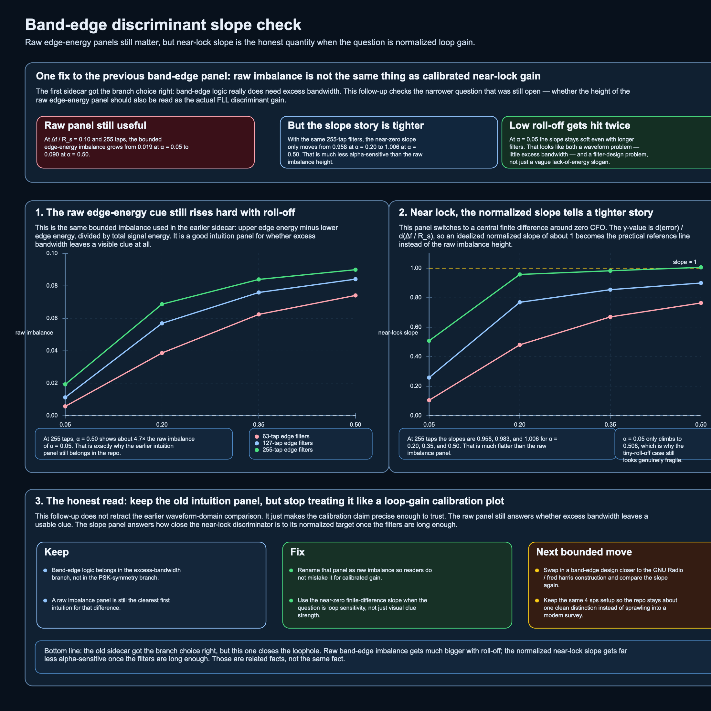

# Band-edge discriminant gain: raw imbalance versus near-lock slope

The previous waveform-domain sidecar made the right first point:

- oversampled 4th-power reads PSK symmetry,
- band-edge logic reads excess-bandwidth structure,
- and the raw edge-energy imbalance gets visibly stronger as roll-off grows.

That note still stands.
What it did **not** settle is whether the height of that raw imbalance panel should also be read as the actual near-lock FLL gain.

This follow-up answers that narrower question.

## 1. The quantity that matters near lock

For a unit-power input, the useful near-lock question is not just

- how big the bounded edge-energy difference looks at some finite offset,

but

- what slope the discriminator has near zero.

That is the object that actually drives loop sensitivity.

In the repo's normalized x-axis, the variable is `Δf / R_s`, not cycles per sample.
So the practical reference line for the local check is an idealized normalized slope of about **1**, not `samples_per_symbol`.

## 2. The local check

The repo now adds:

- `scripts/generate_band_edge_discriminant_slope_figure.py`
- `assets/2026-05-20-band-edge-discriminant-slope-check.csv`
- `assets/2026-05-20-band-edge-discriminant-slope-check.svg`
- `assets/2026-05-20-band-edge-discriminant-slope-check.png`
- `notebooks/band_edge_discriminant_slope.ipynb`

The setup stays bounded:

- SRRC QPSK
- `4 samples/symbol`
- `1024` symbols
- central finite difference at `±0.01 R_s`
- tap counts `{63, 127, 255}`
- roll-off `{0.05, 0.20, 0.35, 0.50}`

The 255-tap rows are the clearest summary:

| roll-off | raw imbalance at `Δf / R_s = 0.10` | near-lock slope |
|---|---:|---:|
| `0.05` | `0.019` | `0.508` |
| `0.20` | `0.069` | `0.958` |
| `0.35` | `0.084` | `0.983` |
| `0.50` | `0.090` | `1.006` |

That table is the whole point.

## 3. What changes, and what does not

### A. Keep the old intuition

The raw band-edge panel still teaches something real:

**band-edge logic needs excess bandwidth.**

At the same modest CFO, the edge-energy imbalance grows sharply as `α` grows.
That is still the cleanest first intuition.

### B. Fix the calibration claim

The raw imbalance height is **not** the same thing as the normalized near-lock slope.

Once the measurement is turned into a central slope and the filters are long enough, the `α = 0.20`, `0.35`, and `0.50` cases all sit close to the normalized target of `1`.
That is much flatter than the raw imbalance panel makes it look.

So the better statement is:

- larger roll-off gives a visibly stronger raw clue,
- but the properly normalized near-lock slope is much less alpha-sensitive than the raw panel alone suggests.

### C. Tiny roll-off is a real weak case

`α = 0.05` stays soft even with `255` taps.
That looks like two problems at once:

1. there is genuinely less excess bandwidth to exploit,
2. the narrow edge region is harder to approximate well with short practical filters.

So the weak low-roll-off case should be read as a waveform-plus-filter-design problem, not just a vague "less energy" story.

## 4. Repo consequence

The earlier note should stay, but with a cleaner label:

- the panel there is a **raw band-edge imbalance** view,
- this note is the calibration check for the near-lock slope.

That split keeps the SDR packet honest:

1. the first sidecar answers **which clue** the front end is reading,
2. this follow-up answers **which quantity** is safe to compare when the question is normalized gain near lock.

## 5. Companion notebook and next move

The notebook `notebooks/band_edge_discriminant_slope.ipynb` walks through the CSV and makes the comparison slower.

If this branch gets one more bounded pass, the best next move is not a bigger survey.
It is a tighter one:

- keep `4 sps`,
- keep the raw imbalance panel as the intuition panel,
- swap in a band-edge design closer to the GNU Radio / fred harris construction,
- and compare the near-zero slope again.

That would sharpen the repo without turning it into a full modem catalog.

## Source basis

This note leans on the same public lane as the earlier sidecar, then narrows the claim:

- Daniel Estévez on band-edge FLL discriminant gain,
- GNU Radio FLL band-edge docs and source,
- Wireless Pi on excess bandwidth as synchronization energy,
- local provenance from the repo's research pass on band-edge discriminant gain.

## Scope boundary

This stays in the study and visualization lane.
It is not a full closed-loop FLL implementation.
It is the smallest durable fix that keeps the earlier comparison honest.
