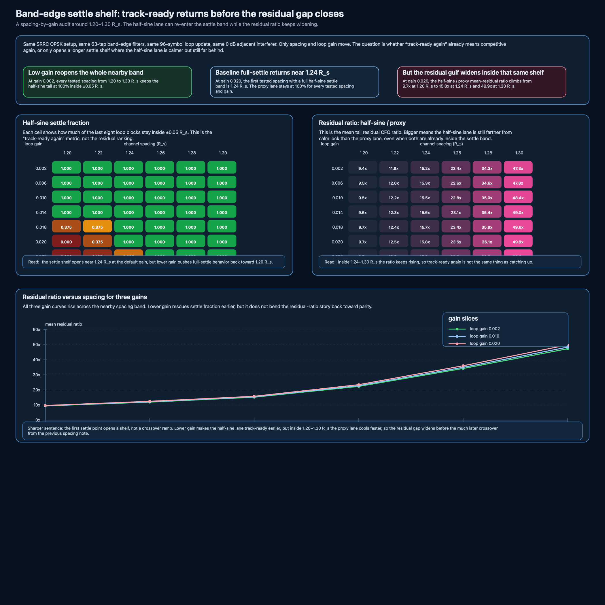

# Band-edge settle shelf: track-ready returns before the residual gap closes

The last two band-edge notes pinned down two facts already:

- the half-sine lane becomes **track-ready again** around `1.24 R_s`,
- but it does not **beat the proxy lane on mean tail residual** until much later.

That still left one honest loophole:

- inside the nearby `1.20–1.30 R_s` band, does the half-sine lane start catching up as soon as it re-enters the settle band?

This note says no.
The first full-settle point opens a **shelf**, not a crossover ramp.

## 1. What moves in this pass

Keep the setup fixed:

- SRRC QPSK
- `4 samples/symbol`
- `3072` symbols
- roll-off `α = 0.35`
- `63`-tap band-edge filters
- one adjacent QPSK interferer at `0 dB`
- one blockwise frequency loop with `96` symbols per update
- tail summary over the last `8` loop blocks
- settle band fixed at `±0.05 R_s`

Only two knobs move:

- channel spacing from `1.20` to `1.30 R_s`
- loop gain from `0.002` to `0.022`

So this is still not BER, not AGC, not timing recovery, and not a full modem benchmark.
It is a bounded follow-up to the spacing and retuning notes.

## 2. The three rows that matter first

| spacing | gain | half-sine settle fraction | half-sine / proxy mean-tail residual ratio |
|---|---:|---:|---:|
| `1.20 R_s` | `0.020` | `0.000` | `9.7×` |
| `1.24 R_s` | `0.020` | `1.000` | `15.8×` |
| `1.30 R_s` | `0.020` | `1.000` | `49.9×` |

That is the whole point.
At the default gain, the half-sine lane does become fully track-ready again by `1.24 R_s`, but the residual ranking is still getting worse across the same band.

## 3. What the shelf result actually says

### A. Lower gain reopens the nearby settle band

At gain `0.002`, every tested spacing from `1.20` through `1.30 R_s` keeps the half-sine tail fraction at `100%`.

So the retuning result was real:
slower gain does calm the loop and it does rescue settle behavior earlier.

### B. But the residual ratio keeps rising anyway

Define the ratio

\[
\rho = \frac{\text{mean tail residual of half-sine}}{\text{mean tail residual of proxy}}.
\]

At gain `0.020`, the ratio grows like this across the nearby band:

- `1.20 R_s`: `9.7×`
- `1.22 R_s`: `12.5×`
- `1.24 R_s`: `15.8×`
- `1.26 R_s`: `23.5×`
- `1.28 R_s`: `36.1×`
- `1.30 R_s`: `49.9×`

So the cleaner sentence is:

**inside this nearby spacing band, “track-ready again” does not mean “catching up again.”**

The proxy lane keeps cooling faster than the half-sine lane even after both are already inside the settle band.

### C. The proxy lane stays boring in exactly the useful way

Across the same spacing and gain grid, the proxy lane kept a full `100%` settle fraction in every tested cell.

That matters because it means this new figure is not showing two fragile loops jostling around each other.
It is showing one loop that is already calm and another that can re-enter the settle band while still carrying a much larger residual tail.

## 4. Small seed check

This still did not turn into a Monte Carlo branch, but I checked four seed pairs:

- `(19,173)`
- `(23,211)`
- `(31,271)`
- `(47,389)`

For gains `0.002`, `0.010`, and `0.020`, the residual ratio stayed strictly increasing across the tested spacings for every one of those seed pairs.

At gain `0.020`, the exact spacing where the half-sine lane recovered a full settle band moved a bit by seed, but the main reading did not:

- the half-sine lane recovered settle first,
- the residual ratio still widened across the same spacing band.

That was enough to keep the public claim narrow and honest.

## 5. How this changes the band-edge branch

The branch now reads more cleanly:

1. [Band-edge closed-loop pull with one adjacent interferer](band-edge-closed-loop-adjacent-pull.md) showed the original `1.0 R_s` failure.
2. [Band-edge spacing boundary: when the loop preference flips](band-edge-spacing-boundary.md) split “track-ready again” from “residual crossover.”
3. [Band-edge loop-gain retuning: slower helps, but the ranking stays the same](band-edge-loop-gain-retuning.md) showed that calmer gain rescales both loops without flipping the order at the first settle point.
4. **This note** closes the next loophole by showing that the nearby spacing band is not a smooth ramp back to parity. It is a settle shelf where the half-sine lane can look recovered on the threshold metric while the residual gulf is still widening.

That is a better stopping sentence than “just retune it” or “wait a tiny bit longer in spacing.”

## 6. Companion files

This note adds:

- `scripts/generate_band_edge_settle_shelf_figure.py`
- `assets/2026-05-27-band-edge-settle-shelf.csv`
- `assets/2026-05-27-band-edge-settle-shelf.svg`
- `assets/2026-05-27-band-edge-settle-shelf.png`
- `notebooks/band_edge_settle_shelf.ipynb`
- `tests/test_band_edge_settle_shelf.py`

## Source basis

Source framing for the detector path and loop interpretation still comes from:

- Daniel Estévez on band-edge filter construction and adjacent-channel burden,
- GNU Radio FLL band-edge documentation,
- GNU Radio source for the half-sine construction and loop-bandwidth normalization,
- Wireless Pi on FLL loop filters and acquisition-versus-tracking bandwidth,
- plus the earlier notes already linked in this band-edge branch.

## Scope boundary

This stays in the receive-side study lane.
It is not BER, not a full modem comparison, and not a claim that one threshold should replace the whole loop story.

It is the smallest follow-up that answers the remaining nearby-spacing question honestly.
