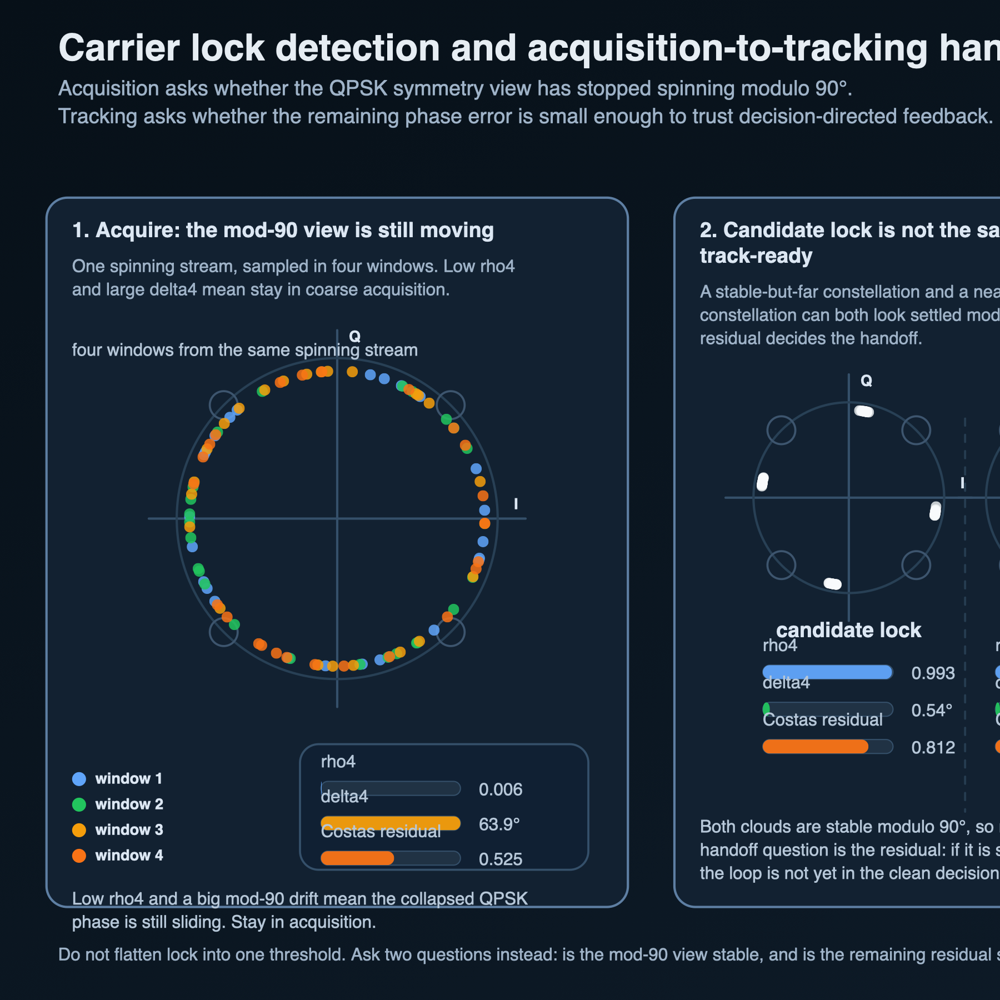

# Carrier lock detection and acquisition-to-tracking handoff

After timing recovery and coarse carrier work, a QPSK receiver still has to answer a smaller question:

**has the constellation really settled enough to trust fine tracking and hard decisions?**

That is the lock-detection problem in the version that matters for this repo.
Not a generic synchronization catalog.
Just the handoff between coarse acquisition and fine tracking.

## 1. The shortest split

Treat these as two different questions:

1. **Has the constellation stopped spinning modulo 90°?**
2. **Is the remaining phase error small enough that decision-directed tracking is trustworthy?**

The first is still an acquisition question.
The second is already a tracking question.

If you flatten both into one vague idea of “lock,” the receiver story gets muddy fast.

## 2. The three signals that matter here

For this note, keep the public metric set small.

### A. `rho4` for mod-90 stability

For QPSK, normalize the samples and collapse the data symmetry with the 4th power:

`rho4 = |(1/N) Σ (z/|z|)^4|`

This is the right acquisition-side view.
If the constellation is still rotating through the window, the 4th-power phasors do not add coherently and `rho4` stays low.
If the constellation is stable modulo 90°, `rho4` rises toward 1.

### B. `delta4` for mod-90 drift between windows

A high `rho4` is stronger when the collapsed phase is also not drifting much from one window to the next.
So this note pairs `rho4` with a simple half-window drift check:

`delta4 = angle(mean_first_half / mean_second_half)` on the 4th-power phasors.

Small `delta4` means the mod-90 view is staying put.
Large `delta4` means you are still watching it slide.

### C. Costas-style residual for near-lock handoff

Once the mod-90 view is stable, the next question is whether the residual phase is small enough for fine tracking.
A compact symbol-rate proxy is

`mean(|sign(Q) I - sign(I) Q| / |z|)`

That is not meant as a production lock detector recipe.
It is a clean public picture of the Costas-style question:

- are the decisions already close enough that feedback points the right way,
- or are we still too far off for hard-decision trust?

## 3. One small simulation snapshot

The figure and CSV sidecar use a simple symbol-rate QPSK toy model with 512 random symbols and light AWGN.
The goal is not to publish a universal threshold table.
The goal is to separate the states cleanly.

See `../assets/2026-05-16-carrier-lock-detection-metrics.csv` for the generated values.

| regime | `rho4` | `delta4` (deg) | Costas residual | `|I|-|Q|` balance | read |
|---|---:|---:|---:|---:|---|
| spinning unlock | 0.006 | 63.91 | 0.525 | 0.011 | still rotating; acquisition not done |
| stable but 35° off | 0.993 | 0.54 | 0.812 | 0.005 | stable modulo 90°, but still too far for clean DD tracking |
| near lock | 0.993 | 0.36 | 0.148 | 0.002 | stable and close enough for fine tracking |
| quadrant-stable `+90°` | 0.992 | 1.39 | 0.035 | 0.000 | carrier-locked modulo 90°, labeling still ambiguous |

The useful split is right there:

- **spinning unlock** has low `rho4` and huge `delta4`, so the symmetry-collapsed view is still moving,
- **stable but 35° off** already looks settled to `rho4`, but the residual is still much too large,
- **near lock** keeps the high `rho4` while finally dropping the residual,
- **+90° locked** also passes the carrier-style tests, which is exactly why label ambiguity is a separate job.

## 4. Why raw `|I|-|Q|` is the wrong public lead metric

This pass explicitly rejects raw QPSK arm-balance as the main teaching metric.

Why:

- it stays small for the 35°-off candidate-lock case,
- it stays small for the `+90°` ambiguity case,
- and it does not cleanly separate the states this repo actually needs to teach.

That does not make arm-balance useless in every context.
It just makes it a bad lead instrument for this QPSK sidecar.

## 5. The tiny state machine the receiver actually wants

A clean receive-side handoff looks like this:

### Acquire

Stay in coarse acquisition while

- `rho4` is still low, or
- `delta4` is still large.

The collapsed QPSK view has not settled yet.
Do not trust decision-directed tracking here.

### Candidate lock

Once

- `rho4` is high, and
- `delta4` is small,

the constellation looks stable modulo 90°.
That is enough to stop blind coarse searching.
But if the Costas-style residual is still large, you are not yet in the clean tracking region.

### Track

Hand off to fine tracking only when

- `rho4` stays high,
- `delta4` stays small,
- and the residual has fallen low enough for several windows.

That is the right point to trust the near-lock feedback story.

## 6. Carrier lock is not label resolution

The `+90°` row matters because it shows the last trap clearly:

a QPSK loop can look carrier-locked modulo 90° and still decode the wrong quadrant labels.

That is not a contradiction.
It is the expected QPSK symmetry.

So this note stops here on purpose.
For the next job, go straight to:

- [QPSK phase ambiguity resolution](qpsk-phase-ambiguity-resolution.md)

Short version:

- **carrier lock** stops the spin,
- **ambiguity resolution** fixes or sidesteps the last 90° label uncertainty.

## 7. Scope boundary

This note stays QPSK-only and symbol-rate only.
That is enough to make the handoff logic visible without turning the repo into a full synchronization survey.
