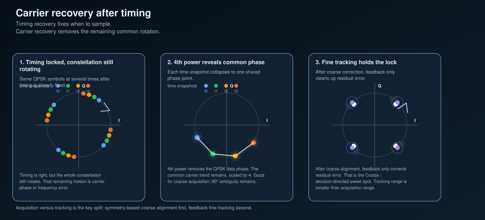

# Carrier recovery after timing

Timing recovery answers **when** to sample.
It does **not** guarantee that the sampled constellation has stopped rotating.

A receiver can be sampling at the right symbol instants and still have a residual carrier phase or frequency error that turns the whole QPSK cloud.
That is why timing lock is not the end of synchronization.

## 1. Why the points can still spin after timing lock

After matched filtering and timing recovery, the receiver is finally taking one useful sample per symbol.
That fixes the sampling phase problem.

But those symbol-rate samples can still look like

- the right four QPSK points,
- rotated by a common angle,
- and sometimes drifting slowly in time.

That remaining motion comes from residual carrier phase or frequency mismatch between transmitter and receiver.
So the next question after timing lock is not

- **when should I sample?**

but

- **how do I de-rotate the symbol samples?**

## 2. Why a decision-directed loop is not the whole cold-start story

If the residual rotation is already small, a Costas loop or other decision-directed tracker has a clean job.
The tentative symbol decisions are mostly right, so the feedback error points in the correct direction.

If the rotation is still large, the same logic becomes fragile:

- the slicer starts picking the wrong quadrant,
- wrong decisions contaminate the phase error,
- and the tracker can pull toward the wrong lock point instead of the right one.

That is the practical reason to split **acquisition** from **tracking**.

## 3. Coarse acquisition with QPSK 4th-power symmetry

QPSK has a 90° rotational symmetry.
If the matched-filter sample is roughly

`z[m] ≈ a[m] e^{jθ[m]}`

then raising it to the 4th power gives

`z[m]^4 ≈ a[m]^4 e^{j4θ[m]}`

and for QPSK, `a[m]^4` is the same for every symbol.

That means the data-dependent phase collapses and the common carrier phase trend survives.
The receiver can use that to make a **coarse** phase estimate before symbol decisions are trustworthy.

This is the useful mental model for the middle panel of the figure:

- the four constellation points stop fighting each other,
- the common rotation becomes easier to see,
- but the estimate is only defined modulo 90°.

So 4th-power acquisition is good for getting into the right neighborhood.
It is **not** the whole answer.

## 4. Fine tracking with Costas or decision-directed feedback

Once coarse correction has removed most of the spin, a feedback loop becomes the right tool.
Now the receiver is close enough that tentative decisions are mostly reliable.

That is the tracking job:

- measure the small residual phase error,
- nudge the local oscillator or de-rotation estimate,
- keep the constellation from wandering away again.

This is where Costas-style tracking fits naturally.
It is strong at **staying locked once close**.
It is not a magic replacement for coarse acquisition range.

## 5. The clean receive-side split

For this repo, the useful sequence is now:

1. matched filtering shapes the receive waveform,
2. timing recovery decides **when** to sample,
3. coarse carrier acquisition removes the big common rotation,
4. fine carrier tracking keeps the residual near zero.

That is the missing bridge between the timing notes and later demodulation.

## 6. Strongest caveat

The 4th-power stage leaves a 90° ambiguity for QPSK.
A practical receiver still needs some later way to resolve symbol labeling, such as known symbols, a unique word, or differential encoding.

But that is a later note.
For this pass, the important distinction is simpler:

- **acquisition range** and **tracking range** are not the same,
- and timing recovery does not solve carrier rotation for you.

## Scope boundary

This note stays in the study and simulation lane. It does not include live-emission procedures.
