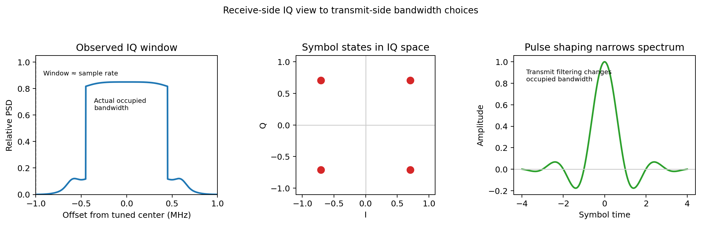

# IQ window, modulation, and bandwidth

The beginner mistake to kill early is this:

> I captured at 2 MS/s, so the signal itself must be 2 MHz wide.

That is not what the sample rate tells you.

## 1. Sample rate sets the observation window

For a complex IQ recording sampled at `fs`, the visible span is roughly `fs` wide and centered on the tuned frequency.

If the receiver is tuned to `fc` and sampled at `2 MS/s`, you are usually looking at about `fc - 1 MHz` to `fc + 1 MHz`.

That is the capture window, not the signal description.

## 2. Occupied bandwidth is a different thing

The signal width depends on things like:

- symbol rate,
- modulation family,
- pulse shaping,
- filtering,
- how much sideband energy is tolerated.

A narrow signal can sit comfortably inside a much wider IQ window.

## 3. Why this matters for transmit-side thinking

Once a receive-side spectrum looks plausibly digital, the next useful questions are:

1. what symbol rate would fit this channel?
2. what modulation family could carry the target bits per symbol?
3. what pulse shaping would keep adjacent-channel spill under control?

That is the bridge from receive literacy to transmit judgment.

## 4. One simple example

Suppose a signal sits comfortably inside a few hundred kHz of a `2 MS/s` capture.

A later transmit-side designer might reason like this:

- QPSK carries 2 bits per symbol,
- `250 ksym/s` gives about `500 kb/s` before coding overhead,
- raised-cosine style shaping keeps occupied bandwidth closer to `Rs (1 + beta)` than to the full capture width.

So the right question is not how to fill the whole ADC window.
The right question is what symbol rate and rolloff fit the channel cleanly.

## 5. Visual bridge

The related bridge figure below makes the same point from the other direction.

## Scope boundary

This note stays in the study and simulation lane. It does not include live-emission procedures.
