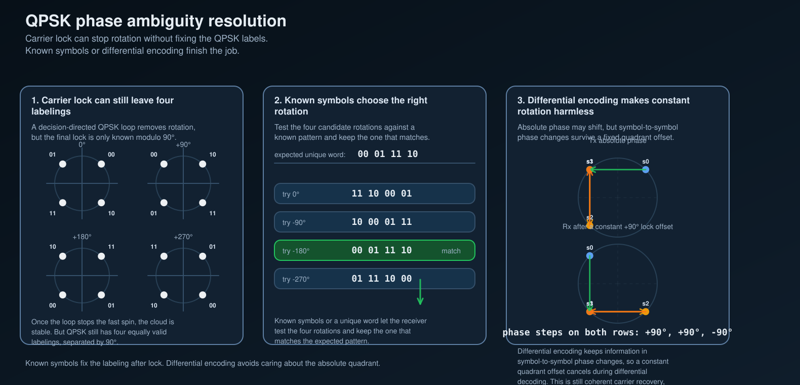

# QPSK phase ambiguity resolution

Carrier recovery can stop the constellation from spinning and still leave one last problem:
for QPSK, the receiver may be locked to the right **shape** but the wrong **quadrant labeling**.

That is the classic 90° phase ambiguity.

## 1. The shortest statement

After carrier lock, the corrected symbols can still look like

`r[m] = s[m] e^{j k\pi/2}`

for some unknown integer `k ∈ {0, 1, 2, 3}`.

So the cloud is stable, but the labeling may still be rotated by 0°, 90°, 180°, or 270°.
That is why a QPSK Costas loop can be locked and the bit decisions can still be wrong.

## 2. Why this survives carrier lock

A decision-directed QPSK carrier loop has stable lock points separated by 90°.
That is not a bug in the implementation.
It comes from the symmetry of the constellation itself.

So the loop can do its main job:

- stop the fast common rotation,
- hold the constellation still,
- keep residual phase error small,

while still not telling you which quadrant labeling is the true one.

This is the exact follow-up to the previous note:
carrier recovery solves the **spin**, not the **symbol naming**.

## 3. Fix one: known symbols or a unique word

The most direct fix is to include a short known pattern.
After carrier lock, the receiver tests the four possible quadrant rotations against that pattern.
Only one rotation should match.

That gives a clean workflow:

1. recover carrier well enough that the cloud is stable,
2. try the four QPSK label rotations,
3. keep the rotation whose known symbols match,
4. decode the payload with that same rotation.

This is the easiest mental model because it separates two jobs cleanly:

- **carrier recovery** makes the constellation usable,
- **known symbols** choose the right labeling.

## 4. Fix two: differential encoding and decoding

The other common fix is to stop storing information in the absolute QPSK quadrant.
Instead, store it in the **phase change from one symbol to the next**.

That is the key idea behind differential encoding:

- transmit a phase step relative to the previous symbol,
- let the receiver decode those phase steps after coherent demodulation,
- allow any constant quadrant offset to cancel out in the difference.

In shorthand form,

`Δφ[m] = φ[m] - φ[m-1]`

and if every symbol is rotated by the same constant offset, that constant disappears in the subtraction.

Important distinction:
this is still a **coherent** receiver with carrier recovery.
It is not the same thing as saying carrier recovery is unnecessary.
It only means the remaining 90° label ambiguity no longer ruins the payload.

## 5. Which fix is doing what

A clean way to remember the split:

- **known symbols / unique word** recover the correct absolute labeling after lock,
- **differential encoding** makes a constant absolute labeling error tolerable.

Or even shorter:

- one fix **chooses** the right quadrant,
- the other fix **stops caring** about the absolute quadrant.

## 6. Practical caveat

Differential encoding is useful, but it is not free.
A bad symbol decision can spill into the decoded phase difference, so one mistake can contaminate more than one decoded symbol step.

Known-symbol methods avoid that specific propagation issue, but they spend payload space on the known pattern.

So this is not a universal winner-take-all choice.
It is a design trade.

## 7. Where this fits in the receive chain

The receive-side story in this repo is now:

1. pulse shaping and matched filtering make the waveform sample-worthy,
2. timing recovery decides **when** to sample,
3. carrier recovery removes the common rotation,
4. ambiguity resolution handles the last QPSK label uncertainty.

That last step is small, but it matters.
Without it, a receiver can look locked on a constellation plot and still decode nonsense.

## Scope boundary

This note stays in the study and simulation lane.
It does not include live-emission procedures.
