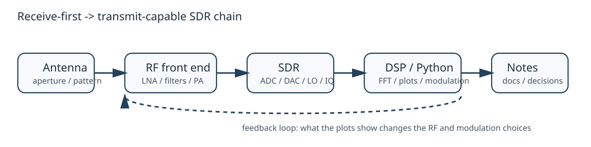

# Receive-first SDR chain

A sane SDR learning path gets much easier once three views stay on the same page:

1. sampled signals and spectra,
2. modulation and constellation geometry,
3. the whole receive/transmit chain.

## 1. Signal literacy first

If sampling rate, IQ samples, FFTs, and visible bandwidth are still fuzzy, everything downstream turns into hand-waving.

The point of this figure is simple: bandwidth, aliasing, leakage, and filtering become visible tradeoffs instead of vague lore.

## 2. Modulation should be visible

Constellations make digital modulation concrete.

Once the symbols are visible, a few things snap into place:

- noise is geometric,
- transmit quality and receive quality live in the same IQ space,
- later demodulation choices stop feeling magical.

## 3. The chain is a loop, not a line

Receive-side understanding naturally leads into transmit-side judgment.

The main shift is conceptual: transmit study is not a detour from receive study. The same plots that explain what was captured also constrain what should ever be sent.

## 4. A compact engineering table

| Layer | Main question | Why it matters |
|---|---|---|
| sampling and FFT | what was actually captured? | prevents fake understanding |
| modulation and IQ | what symbol structure is present? | connects spectra to information |
| link budget | where do power and noise go? | keeps range claims honest |
| system chain | how do RX and TX decisions interact? | turns parts knowledge into architecture |

## 5. One equation worth keeping nearby

$P_r = P_t + G_t + G_r - L_p - L_m$

It is only a stripped-down link-budget sketch, but it keeps gain, loss, and received result on the same page.

## Scope boundary

This repo is theory and visualization only. Live transmission, outdoor antenna work, and active radar remain outside scope.
